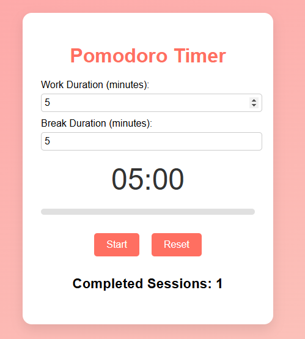

# ⏳ Pomodoro Timer

A modern and customizable Pomodoro Timer application built with **React**. This app helps users improve productivity by following the Pomodoro technique, which alternates focused work sessions with short breaks.

## 🛠 Features

- **Start, Pause, and Reset Timer**: Controls to manage the timer.
- **Custom Durations**: Set your own work and break durations.
- **Session Counter**: Tracks the number of completed Pomodoro cycles.
- **Persistent Data**: Preferences and session counts are saved using `localStorage`.
- **Progress Bar**: Visual representation of timer progress.

## 📸 Screenshots




## 🔧 Installation & Setup

Follow these steps to run the project locally:

1. Clone the repository:
   ```bash
   git clone https://github.com/yourusername/pomodoro-timer.git
   cd pomodoro-timer
   ```
2. Install dependencies:
   ```bash
   npm install
   ```
3. Start the server:
   ```bash
   npm start
   ```

📂 Project Structure
```bash
├── src/         # Add reusable components here if necessary
├── App.js              # Main container component
├── App.css             # Styling for the application
├── index.js            # React entry point
   ```

## 🛠 Built With
- **React**: JavaScript library for building the user interface.
- **localStorage**: To persist data locally in the browser.
- **CSS**: For styling the app.

## 🚀 Future Enhancements
Support long breaks after a set number of sessions.
Display session history and stats with charts.
Add sound alerts and themes.
## 🤝 Contributions
Contributions are welcome! Feel free to fork the repository and submit pull requests. For major changes, please open an issue to discuss what you would like to change.

## 📧 Contact
- **GitHub**: @1oridevs
- **Email**: oridevs.offical@gmail.com